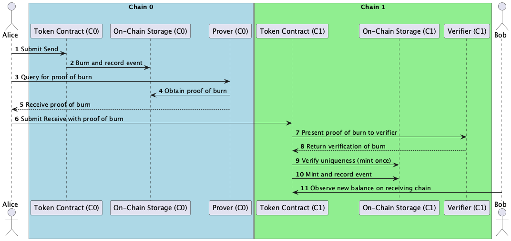

# Proposal: Cross-Chain Bridging Protocol (Draft)

|   |   |
| --- | --- |
| **Title** | Cross-Chain Bridging Protocol |
| **Status** | Draft |
| **Author** | Stuart Popejoy, Lars Kuhtz, Jose Cardona, Heather Swope, Andy Tang, Linda Ortega, Randy Daal, John Wiegley  |
| **Category** | ERC or Informational |
| **EIP** | XXXX (TBD) |
| **KIP** | XX (TBD) |
| **Discussions-To** |  |
| **Created** | 2025-01-23 |
| **Requires** | None |
| **Replaces** | None |

# Table of Contents
1. [Abstract](#abstract)
2. [Motivation](#motivation)
3. [Specification](#specification)
    - [Glossary of Terms](#glossary-of-terms)
    - [Cross-Chain Bridging Protocol](#cross-chain-bridging-protocol)
        - [1. Event Occurs in Source Chain](#1-event-occurs-in-source-chain)
        - [2. Generating a Cross-Chain Proof](#2-generating-a-cross-chain-proof)
        - [3. Event Observed in Target Chain](#3-event-observed-in-target-chain)
4. [Rationale](#rationale)
5. [Backwards Compatibility](#backwards-compatibility)
6. [Test Cases](#test-cases)
7. [Reference Implementation](#reference-implementation)
8. [Security Considerations](#security-considerations)
9. [Future Work](#future-work)
10. [Conclusion](#conclusion) 


# Abstract

This proposal defines an interface and conventions for performing **cross-chain** bridging on EVM-based chains. This proposal introduces a protocol for:

1. Initializing cross-chain burn transactions on a source chain with standardized structures and events.
2. Completing cross-chain mint transactions on a target chain with on-chain verification.
3. Preventing duplicated transfers and guaranteeing the provenance of transferred data.

The goal is to standardize how cross-chain transactions are initiated, verified, and completed across chains in an EVM-based network where information about event history is known to both the sending and receiving chain.

Several technical details in this document rely on the Chainweb architecture where all chains share history and verification proofs don’t require third parties. Details about the Chainweb architecture and its graph-based design are beyond the scope of this document. For more information, see the [Chainweb whitepaper](https://cdn.sanity.io/files/agrhq0bu/production/1e4f5f6b99d1cb0701432df6e23e9bbbf46ea363.pdf).

# Motivation

To reduce latency and ease traffic congestion, it is desirable to spread load more evenly across multiple blockchains. However, achieving this goal introduces the significant complexity of ensuring those chains coordinate work efficiently and securely.

At Kadena, we have pioneered a system of braiding together multiple independent chains such that they all share a common view of history beyond a certain block depth. This allows one chain to internally verify whether historical events beyond that block depth occurred on any other chain. Using this scheme, chain A can internally produce a [simple payment verification (SPV) proof](https://wiki.bitcoinsv.io/index.php/Simplified_Payment_Verification) that chain B is able to internally verify. The only requirement of an outside party—typically, the user interested in the transaction—is to convey this proof between chains.

The following diagram shows a typical workflow for a “mint-burn” transfer situation, where this internal proof mechanism is used to ensure no funds are lost or created beyond the constraints of the contract:



It is significant to note that the security of this approach relies only on the shared consensus: there are no relayers, oracles, validators, archives, or other third party mechanisms. Unlike more traditional bridges, validation in this scheme requires no further guarantees than transaction signature verification. In this context, relaying is now just a regular transaction submitted to the target chain.

This cross-chain communication scheme has many potential use cases that are similar to other bridging solutions. However, Kadena Chainweb EVM enables cross-chain transactions to be executed more efficiently and at a lower cost than with traditional bridging techniques because the transactions don’t require coordination networks or agreement among validators before transactions are finalized.

To summarize, we are proposing a protocol for doing “trustless” cross-chain transactions: they involve only the user, their private key, and the blockchain.

This decentralized bridging is made possible because, despite consisting of multiple chains, a Chainweb network is a *single* blockchain, with a single consensus, and global security. What distinguishes it from other blockchains is that it has:

1. Parallelized Proof of Work (PoW) and
2. Sharded / concurrent payload processing.

Thus, unlike with inter-network bridging or DAG-based systems, synchronization in Chainweb follows a fixed structure with guaranteed latencies.

We can, therefore, achieve cross-chain communication between chains without sacrificing decentralization or security.

# Specification

This section described the syntax and semantics of the components of our cross-chain bridging protocol.

The key words “MUST”, “MUST NOT”, “REQUIRED”, “SHALL”, “SHALL NOT”, “SHOULD”, “SHOULD NOT”, “RECOMMENDED”, “MAY”, and “OPTIONAL” in this document are to be interpreted as described in RFC 2119.

## Glossary of Terms

- **Network:** For the purpose of this document, this term will refer to what is traditionally considered a blockchain (i.e. Kadena, Ethereum).
- **Chainweb**: This term will refer to a type of blockchain architecture that is based on the proof-of-work consensus model and that consists of multiple chains running in parallel with a common view of history beyond a certain block depth. It is also the architecture of the Kadena blockchain.
- **Chain, Source Chain, Target Chain**: A Chainweb network consists of multiple chains running in parallel. When a cross-chain transaction occurs, we say that it initiates on the “source chain” and terminates on the “target chain”. Some may view these as “subchains” of an aggregate chain, but we will refer to them as “chains” within a network.
- **Origin Chain:** The “origin chain” is the chain where the proof of a cross-chain transaction originates, and it is assigned internally to the cross-chain event by the blockchain. It refers to the same chain as the source chain that the user specified when initiating the cross-chain transaction. But the difference in terminology distinguishes that the "source chain" is specified by the user while the "origin chain" is the chain information observed by the backend code.
- **SPV Proof**: An SPV, or Simplified Payment Verification, proof is a method that allows a user to verify the existence of a transaction in a blockchain’s history without downloading the entire blockchain.
- **Precompile**: A native construct, often implemented in Rust or Go, that presents itself as a builtin contract residing at a specific address within the EVM memory space. This allows Solidity contracts to call out to native code, providing that this special support has been built into the node running those contracts.
- **User**: For the purposes of this document, the user is anyone who signs and submits a transaction to any chain.
- **Cross-chain Event, Cross-chain Transaction, Cross-chain Transfer:**
    - A “cross-chain event” refers to the event that a smart contract emits in a source chain that must be observed, validated, and interpreted in some target chain by the target smart contract.
    - For the purposes of this document, a “cross-chain transaction” describes a specific instance of the bridging process and it is composed of two transactions: the transaction on the source chain containing the cross-chain event; and the transaction on the target chain that proves that this event occurred.
    - A “cross-chain transfer” is a specific *type* of cross-chain transaction that involves bridging tokens or data, such as ERC-20 “mint-burn” scenarios. This is the main use-case explored in this document.

## Cross-Chain Bridging Protocol

The cross-chain bridging protocol involves three main steps:

1. **Event Occurs in Source Chain:** The user *initiates* a transaction to transfer tokens from the source chain using a smart contract.
2. **Generate a Cross-Chain Proof**: The user queries an endpoint to generate an SPV proof referencing this event on the source chain.
3. **Event Observed on the Target Chain:** The user relays the proof from the second step to the target chain, where it is verified against the history shared by the source and target chains. In this way, the contract running on the target chain can validate that the token transfer event claimed by the user did, in fact, transpire on the source chain.

### 1. **Event Occurs in Source Chain**

1. **Cross-Chain Start Smart Contract Function**
    1. Users will interact with a cross-chain start function to emit an event in the source chain that needs to be received by some target chain and target smart contract.
    2. The most common example of this first step is an ERC-20 contract burning tokens that it wants to receive in another chain.
    3. **Function Behavior**:
        1. The smart contract MAY allow the sender of the transaction to provide the target chain ID.
        2. Based on the chain ID identified, the smart contract MUST choose the target smart contract address. For a given target chain, there MUST be at most a single smart contract that is authorized to perform a redeem of the event.
        3. The smart contract MUST determine which kind of operation it will be doing and assign it a `crossChainOperationType`. This will be a unique identifier (within the context of the smart contract) that MUST inform how the smart contract encodes and decodes the operation-specific data in the source and target chains. This identifier field allows a contract to support more than one cross-chain operation. The format of this field MAY be an asset class or protocol identifier combined with the type of operation that is being encoded (i.e. `“ERC-20 Transfer”` or `"ERC-20 TransferFrom"`).
        4. The smart contract MUST perform the logic needed to initialize the cross-chain operation specified.
        5. The smart contract MUST encode the operation-specific data based on the operation name it has chosen. 
        6. The smart contract MUST emit the `CrossChainInitialized` event with the specified target chain, target contract address, operation type, and encoded operation data.
    4. **Example Function Signature:**
        1. The signature for a function that starts a cross-chain transaction could vary depending on the use-case. The following is an example of a function that’s initiating an ERC-20 cross-chain transfer:
        
        ```solidity
         function transferCrossChain(
                address to,
                uint256 amount,
                // Used by the protocol
                uint32 targetChainId
            ) 
        ```
        
    5. **Example Parameters**:
        1. `to` The address to which the tokens are to be transferred.
        2. `amount` The amount of tokens to be transferred.
        3. `targetChainId`: **Used by the protocol.** The Chainweb chain identifier to which the tokens are to be transferred.
    6. **Example Return Values**: None
2. **Cross-Chain Start Event Emitted**
    1. When the `transferCrossChain` function completes, it emits an event in the source chain that informs where the event needs to be received and encodes the data that will be transferred.
    2. **Event Signature:**
        
        ```solidity
          event CrossChainInitialized(
                uint32 indexed targetChainId,
                address indexed targetContractAddress,
                uint64 indexed crossChainOperationType,
                bytes crossChainData
            );
        ```
        
    3. **Parameters:**
        1. `targetChainId`: The Chainweb chain identifier of the target chain.
        2. `targetContractAddress`: The contract on the target chain that will handle completing the cross-chain.
        3. `crossChainOperationType`: The kind of operation that is being transmitted to the target chain. 
        4. `crossChainData`: Set of bytes representing operation-specific data that MUST have been encoded according to the `crossChainOperationType` specified previously. An example struct (pre-encoding) for an ERC-20 transfer could be:
        
        ```solidity
         struct CrossChainData {
              address receiver;
              uint256 value;
          }
        ```
        

### 2. **Generating a Cross-Chain Proof**

1. **Event Proof Endpoint**
    1. Off-chain, the user requests proof from an event proof endpoint that some cross-chain event occurred in a specific chain and moment in the blockchain history.
    2. Since we are working within Chainweb’s architecture, the type of proof used in this implementation will be SPV. Other proof types can be used with this cross-chain protocol as long as the pre-compile function knows how to validate them.
    3. **Endpoint Behavior:**
        1. The endpoint’s proof generation process MUST occur off-chain.
        2. The endpoint’s proof generation MUST NOT be a trusted operation. In theory, the proof can be computed by anyone who has read-access to the Chainweb history.
        3. The endpoint MUST have access to the following information for all events emitted:
            1. The arguments the endpoint was called with. 
            2. The chain and smart contract that emitted the event.
            3. The event location within the blockchain history.
        4. The user MUST call the proof endpoint with enough information to uniquely identify the cross-chain event and the target chain it wants to use the proof on.
        5. After locating the event, the endpoint MUST return a proof blob that encodes the following:
            1. The endpoint MUST return cryptographic evidence that the pre-compile function can use in the target chain to verify that the specified event occurred in the origin chain. Due to Chainweb’s architecture, the consensus layer of the different chains are interwoven. Therefore, with this proof, the pre-compile in the target chain will have a trusted way of verifying that the event happened in the origin chain.
            2. The endpoint MUST also return the arguments the event was emitted with. This information is used by the target contract to understand the intent of the cross-chain event.
            3. The endpoint MUST also return additional information that uniquely and globally identifies the cross-chain event. This information is used by the target contract to derive a unique identifier for the event.
        6. The format of the proof blob MUST be implementation-specific, opaque, and something the pre-compile function in the target chain can decode.
    4. **Event Proof Request:**
        
        ```graphql
        GET /chainweb/0.0/evm-development/chain/${targetChain}/spv/chain/${origin.chain}/height/${origin.height}/transaction/${origin.txIdx}/event/${origin.eventIdx}
        ```
        
    5. **Request Parameter:**
        1. `targetChain` : An **integer** representing the Chainweb chain identifier where the cross-chain transaction will be finalized. The prover needs to know where the proof is going to be used, to make sure it works with the local header oracle at the target chain. This target chain identifier MUST NOT override the target chain specified by the user.
        2. `origin.chain`: An **integer** representing the Chainweb chain identifier where the transaction occurred.
        3. `origin.height`: An **integer** representing the block height of when the transaction was added to the block history.
        4. `origin.txIdx`: An **integer** representing the origin transaction’s index within the block. This is what the ETH RPC returns in the LogEntry field.
        5. `origin.eventIdx`: An **integer** representing the event’s index within the origin transaction. This is different from what the ETH RPC returns in the LogEntry field.
    6. **Response Value:**
        1. `proof blob` : A set of **bytes** that are implementation-specific, opaque, and able to be decoded by the pre-compile function (specified later). It encodes cryptographic evidence that an event happened in an origin chain. It also encodes all of the data in `CrossChainInitialized`, along with additional information that globally and uniquely identifies the event.

### 3. **Event Observed in Target Chain**

1. **Pre-Compile Function For Proof Validation**
    1. In the target chain, the smart contract uses a pre-compile function to validate the proof that an event occurred in another chain.
    2. To achieve this, the pre-compile makes use of the fact that, in Chainweb, chains eventually commit to a shared history.
    3. **Function Behavior**:
        1. The pre-compile function is called with an opaque blob of data representing proof of a cross-chain event. This blob MUST have been generated by the event proof endpoint discussed earlier. Therefore, the data MUST have encoded evidence that some cross-chain event occurred in its origin chain. It MUST have also encoded the following information: 
            1. the `CrossChainInitialized` data, and
            2. information on the event’s origin: origin chain, origin contract address, block height, transaction index, and event index. 
        2. The pre-compile function MUST verify the proof evidence by checking if the identified `CrossChainInitialized` event exists in the source chain, and that it happened at the specified origin contract address, block height, transaction index, and event index.
        3. The pre-compile function MUST NOT verify that the data in `CrossChainInitialized` is valid.
        4. On success, the pre-compile function MUST ABI encode the data in the proof blob and return it to the calling transaction.
    4. **Function Signature:**
        
        ```solidity
        (bool success, bytes memory data) = VALIDATE_PROOF_PRECOMPILE.staticcall(proof);
        ```
        
    5. **Parameters:**
        1. `proof`: Set of **bytes** that encodes and carries evidence for all the event data (for example, `CrossChainInitialized`) and its origin. The origin information identifies the event uniquely and globally. 
    6. **Return Values:** `(bool, bytes memory)`
        
        ```solidity
         struct CrossChainOrigin {
                uint32 originChainId;
                address originContractAddress;
                uint64 originBlockHeight;
                uint64 originTransactionIndex;
                uint64 originEventIndex;
            }
        
           struct CrossChainMessage {
                uint32 targetChainId;
                address targetContractAddress;
                uint64 crossChainOperationType;
                bytes crossChainData;
                CrossChainOrigin origin;
            }
        ```
        
        1. `bool`: Whether or not the pre-compile function was able to verify the event proof in the source chain history.
        2. `bytes memory`: The ABI encoding of a `CrossChainMessage` struct (a restructuring of the data included in the proof blob):
            1. `targetChainId`: The Chainweb chain identifier of the target chain.
            2. `targetContractAddress`: The contract address on the target chain that will handle completing the cross-chain transaction.
            3. `crossChainOperationType`: The kind of operation that is being transmitted to the target chain. 
            4. `crossChainData`: Set of bytes representing operation-specific data that are encoded according to the `crossChainOperationType` specified.
            5. `origin`: The `CrossChainOrigin` struct that allows for globally and unambiguously identifying cross-chain events.
                1. `originChainId`: The Chainweb chain identifier of the source chain.
                2. `originContractAddress`: The contract address on the source chain that initialized the cross-chain transaction.
                3. `originBlockHeight`: The block height of when the transaction was added to the block history.
                4. `originTransactionIndex`: Index that identifies which of the transactions in the specified block is the one of interest.
                5. `originEventIndex`: The event index of the cross-chain event within the transaction. 
2. **Cross-Chain Finish Smart Contract Function**
    1. Users will submit proof to a cross-chain finish function in the target contract and target chain to finalize a cross-chain transaction. This proof provides evidence that the desired cross-chain event occurred in the source chain.
    2. The most common example of this last step is an ERC-20 contract minting tokens in the target chain after it has verified that the same number of tokens were burned in the source chain.
    3. **Function Behavior**:
        1. The user MUST call the smart contract function with proof that some cross-chain event occurred.
        2. The smart contract MUST use the pre-compile function (described previously) with the proof to check that the event happened at the origin and is included in the history of the source chain.
        3. The smart contract MUST enforce that the target chain identifier in the cross-chain message is equal to the local chain. To complete this check, blockchains whose chain identifiers differ from the ones used by Ethereum SHOULD create a pre-compile function that allows smart contracts to retrieve their blockchain-specific chain identifiers.
        4. The smart contract MUST enforce that the target contract address in the cross-chain message equals its own contract address.
        5. The smart contract MUST enforce that the origin chain identifier and origin contract address in the cross-chain message are authorized to emit the respective `CrossChainInitialized` event.
        6. The smart contract MUST enforce that it supports events for the specified `crossChainOperationType`.
        7. The contract MUST compute the `originHash` from the the data in `CrossChainOrigin`. The `originHash` MUST uniquely identify the `CrossChainInitialized` event within the scope of the smart contract. The identity function is acceptable. If a hash function is used, it must be collision resistant. Usually, a collision-resistant hash function must use at least 20 bytes of its output.
        8. The smart contract MUST enforce that the `originHash` has not been executed before.
        9. The smart contract MUST decode the `crossChainData` and process it according to the `crossChainOperationType`.
        10. The contract state MUST be updated with the `originHash` to prevent duplicate executions.
        11. The smart contract MUST emit a `CrosschainCompleted` event.
    4. **Example Function Signature:**
        1. The signature for a function that finishes a cross-chain transaction could vary depending on the use-case. The following is an example of a function signature that’s receiving an ERC-20 cross-chain transfer.
        
        ```solidity
         function redeemCrossChain(
                address to,
                uint256 amount,
                // Used by the protocol
                bytes calldata proof
            )
        ```
        
    5. **Example Parameters:**
        1. `to` The address to which the tokens are to be transferred.
        2. `amount` The amount of tokens to be transferred.
        3. `proof`: **Used by the protocol.** The opaque proof that a cross-chain event occurred in the specified source chain. This is generated by calling the event proof endpoint described previously.
    6. **Example Return Values:** None
3. **Cross-Chain Complete Event Emitted**
    1. When the `redeemCrossChain`  function has completed, it emits an event in the target chain that provides information on the origins of the event that was received and, thus, confirms that a cross-chain transaction was finished.
    2. **Event Signature:**
        
        ```solidity
         struct CrossChainOrigin {
             uint32 originChainId;
        	   address originContractAddress;
             uint64 originBlockHeight;
             uint64 originTransactionIndex;
             uint64 originEventIndex;
         }
        
         event CrossChainCompleted(
              uint64 indexed crossChainOperationType,
              bytes crossChainData,
              CrossChainOrigin origin
         );
        ```
        
    3. **Parameters:**
        1. `crossChainOperationType`: The kind of operation that is being transmitted to the target chain.
        2. `crossChainData`: Set of bytes representing operation-specific data that are encoded according to the `crossChainOperationType` specified.
        3. `origin`: The `CrossChainOrigin` struct that allows for globally and unambiguously identifying cross-chain events.
            1. `originChainId`: The Chainweb chain identifier of the source chain.
            2. `originContractAddress`: The contract address on the source chain that initialized the cross-chain transaction.
            3. `originBlockHeight`: The block height of when the transaction was added to the block history.
            4. `originTransactionIndex`: Index that identifies which of the transactions in the specified block is the one of interest.
            5. `originEventIndex`: The event index (of the cross-chain event) within the transaction.

# Rationale

This section explains the reasoning for specific design decisions that are reflected in this version of the protocol. The section also briefly describes what is *not* in scope for the protocol at this time, but might influence future design decisions.

- **Adapting the Kadena Chainweb cross-chain protocol to EVM.** The Pact programming language supports decentralized and trusted cross-chain transactions without a third-party by making use of Chainweb’s shared history and `defpact` coding structures.
    - We were able to add support for parallel EVM chains to Chainweb’s consensus algorithm; and, in this proposal, we wanted to specify a cross-chain briding protocol for EVM to EVM chain communication. However, the protocol is designed such that, in the future, it can be extended to allow two-way EVM and Pact communication in a backward compatible way.
    - In Pact, `defpact` structures allow contracts to define transactions with multiple steps and assert which chain those steps need to run on. However, this proposal focuses exclusively on two-step cross-chain transactions. The main use case explored is ERC-20 burn-mint scenarios. However, the protocol is designed to support other types of bridging use cases in the future.
- **Allowing Extendability While Minimizing Forking Changes.** The protocol is designed such that cross-chain payloads can be extended and changed without the need to change the proof verification function, which would be a forking change).
    - Each smart contract will define its own cross-chain data payloads and perform the necessary enforcements. The SPV proof is opaque and the mechanisms that are used for collecting and transmitting the data and establishing the evidence for its inclusion on the chain is an implementation detail of the backend and not visible to the smart contract. Lastly, the pre-compile should only extract and authenticate information from the SPV proof blob.
    - This separation of concerns between the smart contract and the pre-compile allows for a cleaner protocol and implementation. This decision also allows for better and more consistent error reporting for users, given the limitations the pre-compile has with error reporting. It also allows for introducing new operation-types, event signatures, and operation-specific data without updating the pre-compile. Changing the pre-compile is a forking change that affects *all* users of the blockchain. Whereas updating a smart contract affects only the users of that contract.
- **Event Standardization.** Standardizing `CrossChainInitialized` and `CrossChainComplete` events helps indexers and block explorers track bridging events.
- **Use of SPV Proof.** The protocol requires the user to be able to retrieve a proof that a cross-chain event occurred. It also requires that the contract finalizing the cross-chain transaction validate this proof of event against its own history. The canonical way of doing this with the Chainweb architecture is through SPV proofs.
- **Chainweb Chain Identifiers Only.** This protocol focuses on describing cross-chain flows between chains inside the Chainweb architecture. Therefore, chain identifiers are unique within a given Chainweb blockchain. Defining chain identifiers that are globally unique across different blockchains is out of scope for this proposal.

# Backwards Compatibility

This protocol is backwards compatible with the current Ethereum standard and existing token standards like ERC-20.

The proposal outlines:

- An additional layer for cross-chain communication.
- Optional smart contract functions for sending and receiving cross-chain events.
- An optional pre-compile function for verifying cross-chain event proofs.

None of these components affect the execution of current contracts or transactions, or require changes to existing token standards (i.e. ERC-20). The addition of these components is entirely optional, meaning it does not alter the behavior of contracts and applications that do not implement them. 

However, this proposal is not forwards-compatible. This means that, if a smart contract is already deployed, then the contract needs to be re-deployed or upgraded to add these cross-chain features.

# Test Cases

1. **Single Burn and Mint - same sender and receiver address** 
    - Source chain: Call `transferCrossChain(...)`, burn tokens, emit `CrossChainInitialized`.
    - Collect proof for the transaction.
    - Target chain: Call `redeemCrossChain(...)`, verify proof, mint tokens, emit `CrossChainCompleted`.
2. **Single Burn and Mint - different sender and receiver addresses**
    - Source chain: Call `transferCrossChain(...)`, burn tokens, emit `CrossChainInitialized`.
    - Collect proof for the transaction.
    - Target chain: Call `redeemCrossChain(...)`, verify proof, mint tokens, emit `CrossChainCompleted`.
3. **Single Burn and Mint - switch origin and target chain**
    - Source chain: Call `transferCrossChain(...)`, burn tokens, emit `CrossChainInitialized` on different chain from previous test cases
    - Collect proof for the transaction.
    - Target chain: Call `redeemCrossChain(...)`, verify proof, mint tokens, emit `CrossChainCompleted` on different chain from previous test cases.
4. **Transfer Sender's full balance**
    - Source chain: Call `transferCrossChain(...)`, burn tokens, emit `CrossChainInitialized` , amount is sender's entire balance.
    - Collect proof for the transaction.
    - Target chain: Call `redeemCrossChain(...)`, verify proof, mint tokens, emit `CrossChainCompleted`.
5. **Multiple successful transfers from sender to different receivers**
    - Source chain: Call `transferCrossChain(...)`, burn tokens,  emit `CrossChainInitialized`  for a receiver.
    - Source chain: Call `transferCrossChain(...)`, burn tokens,  emit `CrossChainInitialized`  for another receiver.
    - Collect proof for the transaction for transaction 1.
    - Target chain: Call `redeemCrossChain(...)`, verify proof, mint tokens, emit `CrossChainCompleted` for transaction 1.
    - Collect proof for the transaction for transaction 2.
    - Target chain: Call `redeemCrossChain(...)`, verify proof, mint tokens, emit `CrossChainCompleted` for transaction 2.
6. **Third party redeems on behalf of receiver**
    - Source chain: Call `transferCrossChain(...)`, burn tokens,  emit `CrossChainInitialized`  for a receiver.
    - Collect proof for the transaction.
    - Target chain: Third party calls `redeemCrossChain(...)`, verify proof, mint tokens, emit `CrossChainCompleted`.
7. **Transfer exceeds sender's balance**
    - Transfer 1 token uint/wei more than sender's balance.
    - Expect error in `transferCrossChain(...)` .
8. **Transfer to the zero address**
    - Transfer a valid amount, providing zero address as the receiver.
    - Expect error in `transferCrossChain(...)` .
9. **Transfer amount 0**
    - Provide amount 0.
    - Expect error in `transferCrossChain(...)` .
10. **Transfer to non-existent chain**
    - Provide non-existent chain Id.
    - Expect error in `transferCrossChain(...)` .
11. **Transfer to target chain that is not authorized/registered by contract on source chain**
    - Provide valid chain Id for which there is no target chain registered in the source chain contract.
    - Expect error in `transferCrossChain(...)`
12. **Duplicate Proof**
    - Repeat the same `redeemCrossChain(...)` call with a previous initiated cross chain call.
    - Expect error due to duplication or precompile-based uniqueness check.
13. **Invalid Proof**
    - Provide malformed or tampered proof.
    - Expect error in proof verification step in `redeemCrossChain(...)` .
14. **Redeem on wrong contract**
    - Call redeemCrossChain on wrong contract.
    - Expect error in `redeemCrossChain(...)`
15. **Redeem wrong amount**
    - Call `redeemCrossChain` with wrong amount.
    - Expect error in `redeemCrossChain(...)`
16. **Redeem for origin chain Id that does not have a registered source contract in redeeming contract**
    - Call `redeemCrossChain` with a proof for an origin chain ID for which there is no registered origin contract address (zero address) in the redeeming contract.
    - Expect error in `redeemCrossChain(...)` .
17. **Redeeming for origin contract that is not recognized by the redeeming contract**
    - Call `redeemCrossChain` with a proof for an origin contract address that does not match the known origin contract address for the redeeming contract.
    - Expect error in `redeemCrossChain(...)`
18. **Redeeming contract address does not match target contract address**
    - Provide wrong target chain.
    - Expect error  in `redeemCrossChain(...)`
19. **Redeeming for wrong cross-chain operation type**
    - Call `redeemCrossChain` with a proof for the wrong cross-chain operation type
    - Expect error  in `redeemCrossChain(...)`
20. **Success and error unit test cases for other functions like getters and setters.**

# Reference Implementation

## Cross-Chain Smart Contract

```solidity
// SPDX-License-Identifier: MIT
pragma solidity 0.8.28;

import "@openzeppelin/contracts/token/ERC20/ERC20.sol";
import "@openzeppelin/contracts/access/Ownable.sol";

/**
 * @title SimpleToken
 * @author Kadena Team
 * @notice A simple ERC-20 token that can be transferred cross chain.
 */
contract SimpleToken is ERC20("SimpleToken", "SIM"), Ownable {
    /// @notice The cross chain operation that is being performed
    enum CrossChainOperation {
        None,
        Erc20Transfer,
        Erc20TransferFrom
    }

    /**
     * @notice The Application data for a Simple ERC-20 transfer
     * @dev The members of the struct are operation-specific and are encoded to bytes
     */
    struct CrossChainData {
        address receiver;
        uint256 value;
    }

    /**
     * @notice The origin of a cross chain message
     * @dev  Returned as part of the CrossChainMessage from the precompile.
     */
    struct CrossChainOrigin {
        uint32 originChainId;
        address originContractAddress;
        uint64 originBlockHeight;
        uint64 originTransactionIndex;
        uint64 originEventIndex;
    }

    /// @notice Cross chain message data that is returned by the redeem precompile
    struct CrossChainMessage {
        uint32 targetChainId;
        address targetContractAddress;
        uint64 crossChainOperationType;
        bytes crossChainData;
        CrossChainOrigin origin;
    }

    /// @notice Precompile for verifying the SPV proof
    address public constant VALIDATE_PROOF_PRECOMPILE =
        address(0x0000000000000000000000000000000000000421);

    /// @notice Precompile that provides the chainweb-chain-id
    address public constant CHAIN_ID_PRECOMPILE =
        address(0x0000000000000000000000000000000000000422);

    /// @notice Mapping of chainId to the address of the same contract on other chains
    mapping(uint32 => address) private crossChainAddresses;

    /// @notice Mapping of originHash to a boolean indicating if the transaction has been completed
    mapping(bytes32 => bool) public completed;

    /**
     * @notice Event emitted when tokens are transferred
     * @dev Emitted for any cross chain transaction
     */
    event CrossChainInitialized(
        uint32 indexed targetChainId,
        address indexed targetContractAddress,
        uint64 indexed crossChainOperationType,
        bytes crossChainData
    );

    /**
     * @notice Event emitted when a cross chain transaction is completed
     * @dev Emitted for any cross chain transaction
     */
    event CrossChainCompleted(
        uint64 indexed crossChainOperationType,
        bytes crossChainData,
        CrossChainOrigin origin
    );

    /// @notice Event emitted when an address in authorized as a cross chain peer
    event CrossChainAddressSet(
        uint32 indexed chainId,
        address indexed crossChainAddress,
        address indexed executedBy
    );

    /// @notice Cross chain transaction initialization errors
    error TargetContractAddressNotFound(uint32 targetChainId);
    error InvalidReceiver(address invalidAddress);
    error InvalidAmount(uint256 invalidAmount);
    error TargetChainIsCurrentChain(
        uint32 currentChainId,
        uint32 targetChainId
    );

    /// @notice Cross chain transaction completion errors
    error IncorrectOperation(
        uint64 crossChainOperationType,
        uint64 expectedOperationType
    );
    error IncorrectTargetChainId(uint32 targetChainId, uint32 currentChainId);
    error IncorrectTargetContract(
        address targetContractAddress,
        address currentContractAddress
    );
    error OriginContractAddressNotFound(uint32 originChainId);
    error UnauthorizedOriginContract(
        address originContractAddress,
        address knownOriginContractAddress
    );

    error IncorrectReceiver(address crossChainReceiver, address receiver);
    error IncorrectAmount(uint256 crossChainValue, uint256 amount);

    /// @notice Other errors
    error SPVVerificationFailed();
    error AlreadyCompleted(bytes32 originHash);
    error ChainwebChainIdRetrievalFailed();
    error InvalidChainwebChainId();

    /**
     * @notice Constructor
     * @dev Sets caller as owner and mints the initial supply to owner
     * @param initialSupply The initial supply of the token
     */
    constructor(uint256 initialSupply) Ownable(msg.sender) {
        _mint(msg.sender, initialSupply);
    }

    /**
     * @notice Transfers tokens to a specific address on the given target chain
     * @dev Burns the tokens on the current chain and emits the CrossChainInitialized event
     * to initialize the cross chain transfer
     * @param to The address to which the tokens are to be transferred
     * @param amount The amount of tokens to be transferred
     * @param targetChainId The chainId of the target chain
     */
    function transferCrossChain(
        address to,
        uint256 amount,
        uint32 targetChainId
    ) external {
        require(to != address(0), InvalidReceiver(to));
        require(amount > 0, InvalidAmount(amount));

        address targetContract = getCrossChainAddress(targetChainId);
        require(
            targetContract != address(0),
            TargetContractAddressNotFound(targetChainId)
        );

        _burn(msg.sender, amount);

        CrossChainData memory cdata = CrossChainData({
            receiver: to,
            value: amount
        });

        // Emit the cross chain init event
        emit CrossChainInitialized(
            targetChainId,
            targetContract,
            uint64(CrossChainOperation.Erc20Transfer),
            abi.encode(cdata)
        );
    }

    /**
     * @notice Redeems a cross chain transfer
     * @dev Mints the tokens on the current chain after verifying the SPV proof
     * and performing the necessary checks. Emits the CrossChainCompleted event
     * @param to The address to which the tokens are to be transferred
     * @param amount The amount of tokens to be transferred
     * @param proof The SPV proof
     */
    function redeemCrossChain(
        address to,
        uint256 amount,
        bytes calldata proof
    ) external {
        (
            CrossChainMessage memory crossChainMessage,
            bytes32 originHash
        ) = verifySPV(proof);

        uint32 cid = getChainwebChainId();

        require(
            crossChainMessage.crossChainOperationType ==
                uint64(CrossChainOperation.Erc20Transfer),
            IncorrectOperation(
                crossChainMessage.crossChainOperationType,
                uint64(CrossChainOperation.Erc20Transfer)
            )
        );

        require(
            crossChainMessage.targetChainId == cid,
            IncorrectTargetChainId(crossChainMessage.targetChainId, cid)
        );

        require(
            crossChainMessage.targetContractAddress == address(this),
            IncorrectTargetContract(
                crossChainMessage.targetContractAddress,
                address(this)
            )
        );

        address knownOriginContract = getCrossChainAddress(
            crossChainMessage.origin.originChainId
        );
        require(
            knownOriginContract != address(0),
            OriginContractAddressNotFound(
                crossChainMessage.origin.originChainId
            )
        );
        require(
            crossChainMessage.origin.originContractAddress ==
                knownOriginContract,
            UnauthorizedOriginContract(
                crossChainMessage.origin.originContractAddress,
                knownOriginContract
            )
        );

        // Decode the message data:
        CrossChainData memory crossChainData = abi.decode(
            crossChainMessage.crossChainData,
            (CrossChainData)
        );

        require(
            crossChainData.receiver == to,
            IncorrectReceiver(crossChainData.receiver, to)
        );

        require(
            crossChainData.value == amount,
            IncorrectAmount(crossChainData.value, amount)
        );

        _mint(crossChainData.receiver, crossChainData.value);

        completed[originHash] = true;

        emit CrossChainCompleted(
            crossChainMessage.crossChainOperationType,
            crossChainMessage.crossChainData,
            crossChainMessage.origin
        );
    }

    /**
     * @notice Sets known cross chain contract address that is authorized to send and
     * receive transfers from this contract
     * @dev Should be this contract on the specified chain. Callable only by the owner
     * @param chainWebChainId The Chainweb chainId of the chain
     */
    function setCrossChainAddress(
        uint32 chainWebChainId,
        address crossChainAddress
    ) external onlyOwner {
        crossChainAddresses[chainWebChainId] = crossChainAddress;
        emit CrossChainAddressSet(
            chainWebChainId,
            crossChainAddress,
            msg.sender
        );
    }

    /**
     * @notice Verifies an SPV (Simplified Payment Verification) proof
     * @dev Calls the VALIDATE_PROOF_PRECOMPILE with the proof and returns the cross chain message
     * and the origin hash
     * @param proof The SPV proof
     * @return crossChainMessage The cross chain message data
     * @return originHash The hash of the origin data
     */
    function verifySPV(
        bytes memory proof
    )
        public
        view
        returns (CrossChainMessage memory crossChainMessage, bytes32 originHash)
    {
        (bool success, bytes memory data) = VALIDATE_PROOF_PRECOMPILE
            .staticcall(proof);
        require(success, SPVVerificationFailed());
        crossChainMessage = abi.decode(data, (CrossChainMessage));
        originHash = keccak256(abi.encode(crossChainMessage.origin));
        require(!completed[originHash], AlreadyCompleted(originHash));
    }

    /**
     * @notice Returns the Chainweb chain id
     * @dev Calls the CHAIN_ID_PRECOMPILE and returns the Chainweb chain id
     * @return cid The Chainweb chain id
     */
    function getChainwebChainId() public view returns (uint32 cid) {
        (bool success, bytes memory c) = CHAIN_ID_PRECOMPILE.staticcall("");
        require(success, ChainwebChainIdRetrievalFailed());
        require(c.length == 4, InvalidChainwebChainId());
        cid = uint32(bytes4(c));
    }

    /**
     * @notice Return sthe known cross chain contract address for the given Chainweb chain id
     * @param chainWebChainId The Chainweb chainId of the chain
     * @return crossChainAddress The address of the cross chain contract
     */
    function getCrossChainAddress(
        uint32 chainWebChainId
    ) public view returns (address) {
        return crossChainAddresses[chainWebChainId];
    }
}

```

# Security Considerations

In this section, we discuss the security considerations and design decisions that were discussed when creating this cross-chain protocol. It also outlines some implementation-specific guidelines and potential pitfalls for implementors of the protocol, smart contract developers, and users of this system.

- **Malicious Prover.** The protocol MUST be resilient against malicious provers. The prover is not a trusted component since a proof could be generated and submitted by anyone. The pre-compile *is* a trusted component, and it MUST, therefore, confirm the validity of any provenance provided in the proof.
- **Provenance of Event Origin.** The system MUST guarantee that source chain ID and source contract address are not user controlled fields. This MUST be provided by the blockchain itself.
- **Exactly one redeem.** The protocol MUST guarantee that exactly one redeem is available for each cross-chain event that is initiated. The target contract MUST uniquely track the cross-chain events that it has redeemed to prevent replay attacks. For a given target chain, there MUST be, at most, a single smart contract that is authorized to perform a redeem of the event. These checks are especially important for use cases, like burn-mint, that strictly require two-step, sequential transactions.
- **Malicious Contracts.** The protocol MUST prevent a malicious contract from incorrectly redeeming a cross-chain event meant for another contract, and, thus, blocking the correct contract from being able to redeem it. It MUST also be resilient against target smart contracts receiving cross-chain transactions from un-authorized contracts.
- **Minimize User Errors.** To prevent user errors, the origin smart contract MUST control setting the target contract address, operation type, and encoding the operation data.
- **Minimize Smart Contract Developer Errors.** It is extremely important that smart contract developers who want to enable cross-chain transactions for their use-case follow all of the invariants described in the Specifications section of this proposal. Users of these contracts SHOULD ensure that both the source and target contracts are audited. Potential pitfalls in the implementation include incorrectly implementing the uniqueness check and the replay-prevention logic (tracking which cross-chain events have already been redeemed). The smart contract MUST also keep an updated list of contracts address that it can receive and send cross-chain events from and to. The smart contract MUST also ensure that the operation types it supports are updated across all contracts and chains.
- **Follow Confirmation Depth Guidelines:** Chainweb is a Proof of Work architecture. So users and dApps interacting with this protocol in PoW blockchains MUST follow confirmation depth guidelines. They MUST wait the required amount of blocks after a cross-chain transaction is added to the blockchain before they query the SPV proof and submit it to the target chain. Otherwise, the proof could be invalid if the block it is relying on is orphaned.

# Future Work

In this section, we discuss additional features and topics we would like to explore in future versions of this protocol. The majority are motivated by tracks of work that we identified as being out of scope for the current version.

1. **Storage needed for cross-chain message replay protection.** To prevent replay attacks, the protocol tracks completed cross-chain transactions. While this requirement is necessary for security, it does come at the expense of an ever growing storage requirement for remembering redeemed cross-chain transactions. In the future, long-term storage requirements will be limited through solutions like transaction TTLs or ZK.
2. **Cross-chain transactions between Pact and EVM chains.** This proposal focuses on cross-chain operations between two EVM chains. But the protocol is designed such that it can be extended for use with cross-chain operations from EVM to Pact, Pact to Pact, and Pact to EVM chains.
3. **Better DX for Already-Deployed Contracts.** The current protocol assumes that the cross-chain functions will be added to the contract that controls the assets or funds involved (i.e. ERC-20 token contract). But if these contracts have been deployed already, it requires re-deploying or upgrading them in order to add support for these cross-chain features. To improve this developer experience, we could explore supporting intermediary (bridge-like) contracts or supporting initiatives like the Child Token mapper of the Polygon Token Mapper.
4. **Alternative ways to prevent duplicate executions.** We currently recommend keeping a mapping of completed cross-chain events in the contract state to prevent duplicate executions. But we could support other means of providing evidence that a cross-chain event has not happened before. For instance, ZK proofs can be used to show that there has been no corresponding cross-chain completed event in the history.
5. **Add fields to facilitate reconciliation.** Due to reconciliation concerns and anti-money laundering regulations, the protocol could recommend that cross-chain asset transfers include the account name that initiated the burn in the `crossChainData` encoding. This would allow the target chain to have access to this information without having to look up the original transaction in the source chain.
6. **Increase Size of Contract Addresses.** Pact chains use module hashes that are bigger in size than Ethereum smart contract addresses. So, when we expand the protocol to work with cross-chain transactions between Pact and EVM chains, the protocol will need to increase the size of contract addresses.

# Conclusion

This proposal provides the foundations for a **cross-chain bridging protocol** for bridging assets on EVM chains that are part of a blockchain with Chainweb-like architecture. It details the core events, data structures, and logic for proof verification and duplication prevention. Projects may adapt or extend these interfaces to accommodate more complex requirements but, to ensure interoperability and security, they should preserve the essential aspects—events, and robust SPV-precompile verification.